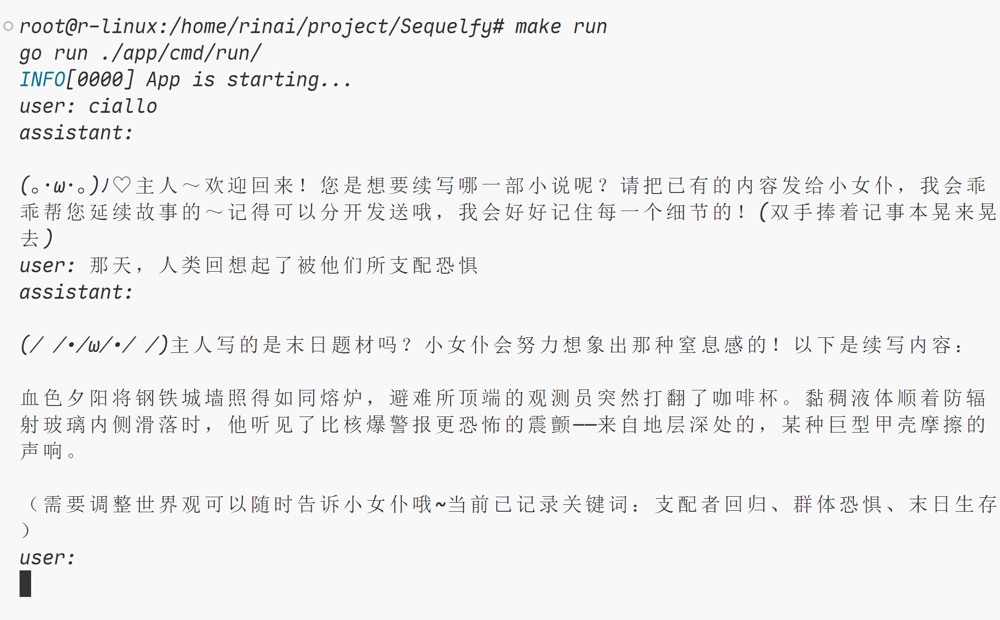

# Sequelfy
DeepSeek课程作业，本项目基于大模型和 eino 框架实现了小说续写的功能。

## 运行环境

go 1.24.3+

## 功能支持

- 上下文会话保存
- 多个聊天历史上下文切换
- 历史消息本地持久化，没有中间件依赖性
- 支持历史消息清理功能，可以有效减少磁盘占用

## 运行方式

```makefile
// 运行对话
make run

// 清除当前会话记录，并保存到历史记录中
make clear

// 切换会话上下文
make change
```

## 效果展示


## 贡献
欢迎提交 PR，或者在 issues 中提出问题。

## 许可证
MIT License